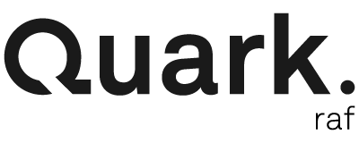

# [](https://github.com/fm-ph/quark-raf)

[![build status][travis-image]][travis-url]
[![stability][stability-image]][stability-url]
[![npm version][npm-image]][npm-url]
[![coverage][coveralls-image]][coveralls-url]
[![js-standard-style][standard-image]][standard-url]
[![semantic-release][semantic-release-image]][semantic-release-url]

Simple requestAnimationFrame based on [__Singleton__](https://en.wikipedia.org/wiki/Singleton_pattern) design pattern.

___This package is part of `quark` framework but it can be used independently.___

## Installation

[](https://www.npmjs.com/package/quark-raf)

```sh
npm install quark-raf --save
```

## Usage

### Add a listener

```js
import Raf from 'quark-raf'

const callback = () => { }

Raf.add(callback)
```

### Add a listener with options

```js
import Raf from 'quark-raf'

const callback = () => { }
const fps = 30
const delay = 1000 // in milliseconds

Raf.add(callback, fps, delay)
```

### Add once a listener

```js
import Raf from 'quark-raf'

const callback = () => { }

Raf.addOnce(callback)
```

### Remove a listener

```js
import Raf from 'quark-raf'

const callback = () => { }

Raf.add(callback)
Raf.remove(callback)
```

## API

See [https://fm-ph.github.io/quark-raf/](https://fm-ph.github.io/quark-raf/)

## Build

To build the sources with `babel` in `./lib` directory :

```sh
npm run build
```

## Documentation

To generate the `JSDoc` :

```sh
npm run docs
```

To generate the documentation and deploy on `gh-pages` branch :

```sh
npm run docs:deploy
```

## Testing

To run the tests, first clone the repository and install its dependencies :

```sh
git clone https://github.com/fm_ph/quark-raf.git
cd quark-raf
npm install
```

Then, run the tests :

```sh
npm test
```

To watch (test-driven development) :

```sh
npm run test:watch
```

For coverage :

```sh
npm run test:coverage
```

## License

MIT [License](LICENSE.md) © [Patrick Heng](http://hengpatrick.fr/) [Fabien Motte](http://fabienmotte.com/) 

[travis-image]: https://img.shields.io/travis/fm-ph/quark-raf/master.svg?style=flat-square
[travis-url]: https://travis-ci.org/fm-ph/quark-raf
[stability-image]: https://img.shields.io/badge/stability-stable-brightgreen.svg?style=flat-square
[stability-url]: https://nodejs.org/api/documentation.html#documentation_stability_index
[npm-image]: https://img.shields.io/npm/v/quark-raf.svg?style=flat-square
[npm-url]: https://npmjs.org/package/quark-raf
[coveralls-image]: https://img.shields.io/coveralls/fm-ph/quark-raf/master.svg?style=flat-square
[coveralls-url]: https://coveralls.io/github/fm-ph/quark-raf?branch=master
[standard-image]: https://img.shields.io/badge/code%20style-standard-brightgreen.svg?style=flat-square
[standard-url]: https://github.com/feross/standard
[semantic-release-image]: https://img.shields.io/badge/%20%20%F0%9F%93%A6%F0%9F%9A%80-semantic--release-e10079.svg?style=flat-square
[semantic-release-url]: https://github.com/semantic-release/semantic-release
